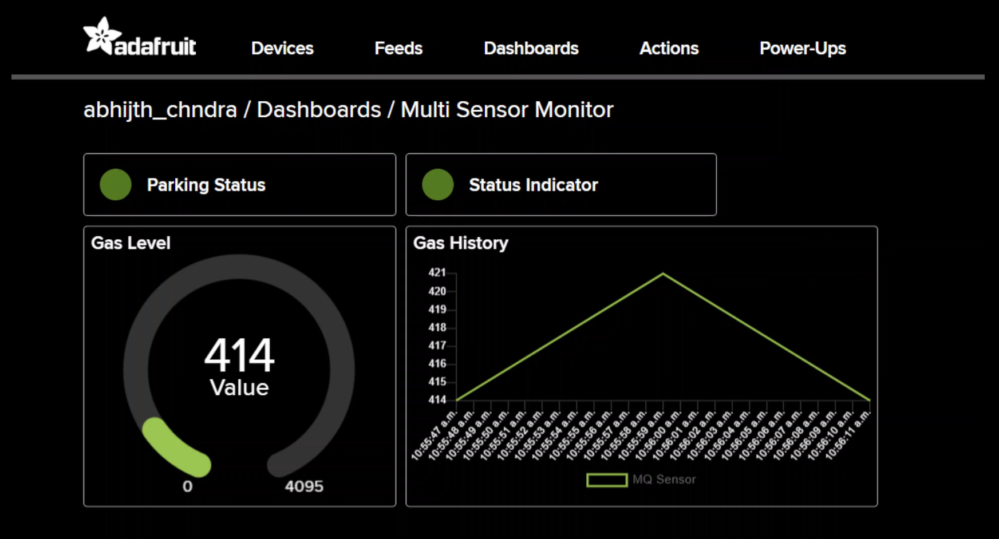

# Real-Time-Multi-Sensor-IoT-Monitoring-System
STM32F767ZI multi-sensor IoT monitor with FreeRTOS, LwIP, and Adafruit IO cloud dashboard

# 🅿️ SmartSlot — IoT Parking & Environment Monitor

> Real-time parking occupancy and environment monitoring using STM32F767ZI,
> FreeRTOS, LwIP Ethernet, and Adafruit IO cloud dashboard.


---

## 🔧 Hardware

| Component | Purpose | Interface |
|---|---|---|
| STM32F767ZI (Nucleo-F767ZI) | Main MCU | — |
| HC-SR04 Ultrasonic Sensor | Parking occupancy detection | TIM3 Input Capture |
| MQ Gas Sensor | Air quality / gas detection | ADC1 CH10 (PC0) |
| MH IR Sensor (Flying Fish) | Object/presence detection | GPIO Input (PF0) |
| LAN8742A (onboard) | Ethernet PHY | RMII |

---

## 📡 System Architecture

HC-SR04 ──TIM3 IC──┐
MQ Sensor ─ADC1────┼──► FreeRTOS Tasks ──► LwIP TCP ──► Adafruit IO
MH IR ────GPIO─────┘ │
└──► UART Debug (115200)

---

## 🖥️ Adafruit IO Dashboard



Live feeds:
- **parking** — OCCUPIED / EMPTY
- **gas** — Raw ADC 0–4095
- **ir-sensor** — DETECTED / CLEAR

---

## 🧵 FreeRTOS Task Design

| Task | Priority | Period | Role |
|---|---|---|---|
| vTaskNetwork | High | 1 ms | LwIP pump + cloud upload |
| vTaskUltrasonic | AboveNormal | 500 ms | HC-SR04 trigger + ISR wake |
| vTaskGasSensor | Normal | 1000 ms | MQ ADC read |
| vTaskIRSensor | Normal | 200 ms | MH IR GPIO read |
| vTaskDebug | Low | 1000 ms | UART status print |

### Synchronisation Objects
- `xSensorMutex` — protects shared sensor data struct
- `xUltrasonicSem` — binary semaphore: TIM3 ISR → vTaskUltrasonic
- `xUploadQueue` — message queue (depth 4): sensor tasks → network task

---

## 📌 Pin Map

| Pin | Label | Peripheral | Sensor |
|---|---|---|---|
| PB0 | TRIG | GPIO OUT | HC-SR04 Trigger |
| PB1 | ECHO | TIM3_CH4 | HC-SR04 Echo |
| PC0 | AO | ADC1_IN10 | MQ Gas Sensor |
| PF0 | DO | GPIO IN | MH IR Sensor |
| PD8/PD9 | TX/RX | USART3 | Debug UART |

---

## 🚀 How to Build & Flash

1. Open `SmartSlot.ioc` in STM32CubeMX and generate code
2. Open the project in STM32CubeIDE
3. Update credentials in `main.c`:
```c
const char *AIO_USERNAME = "your_username";
const char *AIO_KEY      = "aio_xxxxxxxxxxxx";
```
4. Build (Ctrl+B) → Flash (Run → Debug)
5. Open serial terminal at **115200 baud** to see live readings

---

## 📚 What I Learned

- Implementing FreeRTOS tasks, mutexes, semaphores, and message queues
- ISR-to-task notification using `xSemaphoreGiveFromISR()`
- LwIP raw TCP API for HTTP POST to cloud IoT platform
- STM32 Timer Input Capture for ultrasonic distance measurement
- ADC polling for resistive gas sensors
- Adafruit IO Group API for simultaneous multi-feed updates

---

## 📄 License
MIT License — free to use for learning and personal projects.
